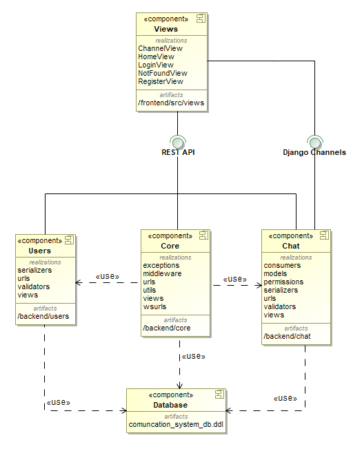
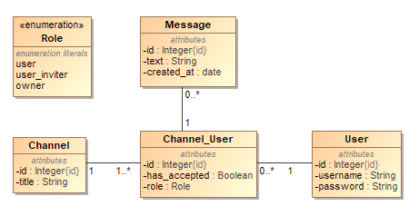

# komunikacijos-sistema
## 1. Užduoties aprašymas

**Tikslas: Sukurti realaus laiko komunikacijos sistemos prototipą**

**Reikalavimai sistemai. Sistemą sudaro:**
 - E-platforma leidžianti naudotojui registruotis sistemoje;
 - Naudotojas gali prisijungti/atsijungti nuo sistemos;
 - Naudotojas gali sukurti pokalbių kanalą ir prie jo prisijungti;
 - Naudotojas pakviesti kitą naudotoją į kanalą;
 - Naudotojas gali komunikuoti su kitu naudotoju realiu laiku teksto žinutėmis;
 - Naudotojas gali peržiūrėti kanalui priklausančių naudotojų sąrašą.

**Uždaviniai:**
 1. Sistemos specifikacijos sukūrimas:
     - architektūra (components);
     - duomenų bazės struktūra (entity model);
     - naudotojai (users);
     - naudotojų istorijos (user stories).
 1. Frontend prototipo realizacija (Javascript, React);
 1. Backend prototipo realizacija (Django, Python);
 1. Backend-Frontend integracija;
 1. Testavimo plano sudarymas.

## 2. Sistemos specifikacija
### 2.1. Architektūra (komponentai)

Kuriamos sistemos prototipo komponentų diagrama pateikta žemiau matomame paveikslėlyje:

Iš pateikto paveikslėlio matoma, kad sistema naudoja duomenų bazės komponentą, sistemos „backend“ dalis sudaryta iš 3 aplikacijų („Users“, „Core“, „Chat“), o sistemos „fronend“ dalis susidaro iš kelių skirtingų langų. „frontend“ ir „backend“ sistemos dalys komunikuoja naudojant REST API, o tam, kad žinutės kanaluose būtų pateikiamos realiu laiku naudojami „Django Channels“.

### 2.2. Duomenų bazės struktūra

Duomenų bazės struktūra matoma žemiau pateiktame duomenų bazės ER modelyje:

### 2.3. Naudotojai

**Naudotojų rolės:**
 - Svečias;
 - Naudotojas.

**Prisiregistravusių naudotojų rolės pokalbių kanale:**
 - Kanalo naudotojas;
 - Kanalo naudotojas galintis kviesti kitus sistemos naudotojus į kanalą;
 - Kanalo savininkas.

### 2.4. Naudotojų istorijos

 1. Kaip svečias, norėčiau susikurti paskyrą, kad galėčiau gauti prieigą prie komunikacijos sistemos teikiamų paslaugų;
 1. Kaip naudotojas, norėčiau prisijungti prie sistemos, kad galėčiau lengvai pratęsti naudojimąsi komunikacijos sistema;
 1. Kaip naudotojas, norėčiau atsijungti nuo sistemos, kad galėčiau lengvai pabaigti naudojimąsi komunikacijos sistema;
 1. Kaip naudotojas, norėčiau sukurti pokalbių kanalą, kad galėčiau pradėti bendrauti su kitais komunikacijos sistemos naudotojais;
 1. Kaip naudotojas, norėčiau gauti pakvietimus į pokalbių kanalus, kad galėčiau prie jų prisijungti;
 1. Kaip naudotojas, norėčiau turėti pasirinkimą priimti arba atmesti pakvietimus į pokalbių kanalus, kad galėčiau atsirinkti tik tuos kanalus, į kuriuos noriu prisijungti, o pakvietimai netrukdytų naudotis sistema;
 1. Kaip pokalbių kanalo naudotojas (įskaitant visas registruotų naudotojų pokalbių kanale roles), norėčiau peržiūrėti kanalui priklausančių naudotojų sąrašą, kad žinočiau su kuo bendrauju teksto žinutėmis;
 1. Kaip pokalbių kanalo naudotojas (įskaitant visas registruotų naudotojų pokalbių kanale roles), norėčiau siųsti teksto žinutes, kurias realiu laiku gautų visi kanalo naudotojai, kad galėčiau greitai ir patogiai apsikeisti informacija su tam tikro kanalo naudotojais
 1. Kaip pokalbių kanalo naudotojas (įskaitant visas registruotų naudotojų pokalbių kanale roles), norėčiau gauti teksto žinutes siųstas kanalo naudotojų realiu laiku, kad galėčiau greitai bei atitinkamai reaguoti į pateiktą informaciją
 1. Kaip pokalbių kanalo naudotojas galintis kviesti kitus sistemos naudotojus į kanalą, norėčiau siųsti pakvietimus kitiems naudotojams, kad galėčiau pasirinkti, su kuriais sistemos naudotojais noriu komunikuoti;
 1. Kaip pokalbių kanalo savininkas, norėčiau pakviesti kitus naudotojus į savo kanalą, kad galėčiau pasirinkti, su kuriais sistemos naudotojais nori komunikuot;
 1. Kaip pokalbių kanalo savininkas, norėčiau kanalo nariams duoti teisę siųsti pakvietimus kitiems naudotojams, kad į kanalą būtų lengviau sukviesti visus sistemos naudotojus, su kuriais norima bendrauti;
 1. Kaip pokalbių kanalo savininkas, norėčiau kanalo nariams atimti teisę siųsti pakvietimus kitiems naudotojams, kad jie šia teise negalėtų piktnaudžiauti.

## 3. Testavimo planas
### 3.1. Testavimo apimtis

Bus testuojamos didžiausią įtaką veikimui turinčios sukurto komunikacijos sistemos prototipo dalys („Chat“ aplikacija, „Users“ aplikacija). Testuojant bus atsižvelgiama į prieš tai pateiktus reikalavimus bei suformuotas naudotojų istorijas. Pasitelkiant turimus reikalavimus bus bandoma įvertinti, kaip realizuotas sistemos funkcionalumas juos atitinka.

### 3.2 Testavimo strategija

**Prieš pradedant testavimą turi būti:**
 - Parengta kuriamos sistemos prototipo dokumentacija;
 - Pilnai išbaigtas sistemos prototipas;
 - Pasirinkti testavimo įrankiai bei atitinkamai paruošta aplinka testavimui;
 - Aiški procedūra testavimo metu rastoms klaidoms ištaisyti;
 - Nustatytas testavimo sėkmės kriterijus.

**Programinės įrangos testavimui bus pasitelkiami šie būdai:**

 - Vienetų testavimas. Šis testavimo būdas padės užtikrinti, kad izoliuotoje aplinkoje smulkiausios sistemos dalys (funkcijos, metodai) veikia taip kaip priklauso. Vienetų testavimo nauda: greitesnis klaidų aptikimas, geresnės kokybės kodas, kodo perpanaudojamumas, geresnės kokybės dokumentacija;
 - Integracinis testavimas. Sistemai testuoti pasirinktas šis testavimo būdas, nes sistemoje vyksta dažna komunikacija tarp atskirų posistemių bei klientinės dalies (REST API, django channels) ir norint įsitikinti, kad komunikacija vyksta teisingai reikia patikrinti, ar posistemės tarpusavyje integruojasi korektiškai;
 - Regeresinis testavimas. Kadangi pilnai parengtas tik sistemos prototipas, tai jei bus norima kurti sistemą toliau, reikės užtikrinti, kad pridedant naują funkcionalumą nebus neigiamai paveikiamas jau esamas. Šis testavimo būdas padės užtikrinti, kad taip nebūtų;
 - Greitaveikos testavimas. Kadangi kuriama komunikacijos sistema turi veikti našiai net ir esant didelėms apkrovoms ir užtikrinti gerą naudotojo patirtį, tai pasirinktas šis testavimo būdas, kuris turėtų padėti tai užtikrinti.
 - Saugumo testavimas. Šis sistemos testavimo būdas pasirinktas norint įsitikinti bei užtikrinti, kad pokalbių kanalai prieinami tik tiems naudotojams, kurie priklauso tiems kanalams.

**Testavimo prioritetai:**

 1. Greitaveikos testavimas – Sistema turi veikti našiai norint užtikrinti gerą naudotojo patirtį, kai sistema naudojasi daug naudotojų;
 1. Saugumo testavimas – Svarbu norint užtikrinti, kad duomenys būtų prieinami tik, naudotojams, kuriems jie yra skirti. Saugi sistema padidina naudotojų pasitikėjimą;
 1. Integracinis testavimas– Svarbu užtikrinti korektišką komponentų tarpusavio integraciją norint, kad sistemos komponentai teisingai komunikuotų;
 1. Vienetų testavimas – Svarbu įsitikinti, kad mažiausios sistemos dalys veikia korektiškai;
 1. Regresinis testavimas – Šis testavimo būdas labiau naudingas plečiant jau ištestuotą sistemą.

### 3.3. Testavimo sėkmės kriterijai

Sistemos prototipas bus laikomas sėkmingai ištestuotu, jei pagrindinių prototipo dalių („Chat“ aplikacijos, „Users“ aplikacijos) veikimas tenkins anksčiau nurodytus reikalavimus bei apsibrėžtas naudotojų istorijas. Taip pat testavimo metu rasti defektai, kurie naudotojui neleistų sėkmingai naudotis sistema, turėtų būti ištaisyti.
